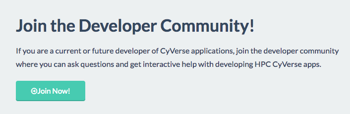

# CyVerse Software Development Kit

[CyVerse](https://www.cyverse.org) provides full scriptable access 
to its underlying infrastructure via the [Agave API](https://www.agaveapi.co), 
a comprehensive set of RESTful web services that make it easy for developers and users to:
* Develop and run applications on HPC, Cloud, Condor, and container-based computing systems
* Use MyProxy-based authentication for federated identity
* Bring their own computing and storage resources into CyVerse
* Share data and applications, even with people who aren't CyVerse users
* Connect computing and data tasks via web-based events
* Manage data on any cloud storage platform one has access to
* Build sophisticated web-based applications that take advantage of all these underlying capabilities

We're providing this software development kit to help you with

1. Creating and running in creating your own computing applications to be deployed at CyVerse
2. Using CyVerse applications deployed by other people to analyse your (or other people's) data at a large scale
3. Sharing data at CyVerse or on other systems with collaborators
4. Bringing your own HPC computing and data resources into CyVerse for yourself or other people to use

### Tutorials

[Getting Started with CyVerse SDK](getting-started.md) | 

[Develop an Application for CyVerse](app-dev.md) | 

[Use Your Own Cluster on CyVerse](register-your-cluster.md) |

### Reporting errors and getting help

### Additional Guides
Over time, we will add tutorials to address more use cases, 
for example: working with cloud systems including Amazon Web Services, 
Google Compute Engine, or [NSF Jetstream](https://use.jetstream-cloud.org/); 
building web applications; and improving reproducible science and analysis with Docker. 
Here are some additional guides currently available:

* [Using an Atmosphere VM as an Agave Execution System](atmo-system.md)
* [Cloning a CyVerse application to your own systems](iplant-clone-app.md)
* [Using the Agave CLI to interact with various aspects of the CyVerse Cyberinfrastructure](https://github.com/wjallen/using-agave)

---

| [Back to CyVerse Developer Portal](../index.md) |
