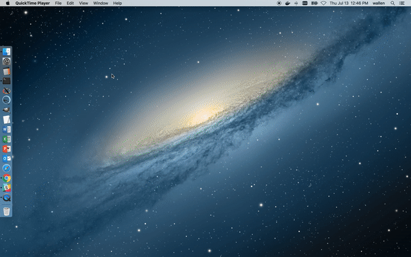
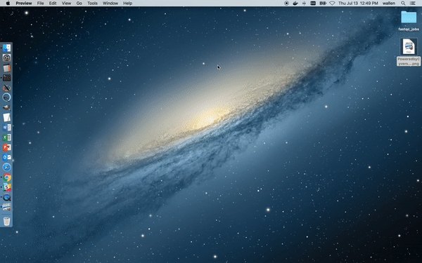
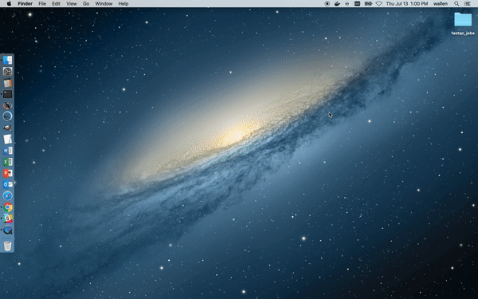
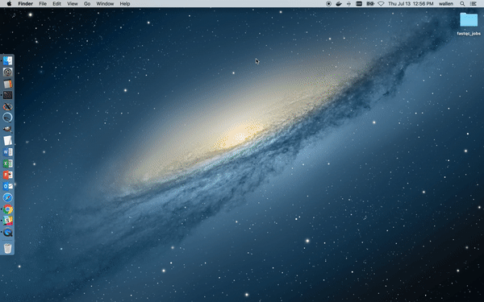
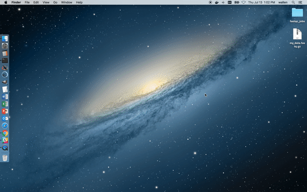
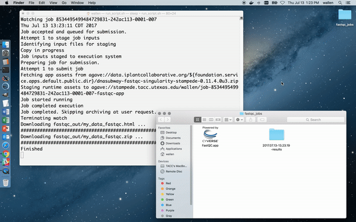

## Mac OS App Development Kit

This tutorial shows how to wrap an existing, public CyVerse app into a clickable application on your Mac. This might be useful if:

* You want to perform an analysis in as few clicks as possible
* You have repetetive tasks / jobs and lots of data
* You want to easily automate an analysis pipeline
* You (or someone you support) has no command line experience

Here, we will go through the steps for creating a Mac OS app for `.fastq` data quality control with [FastQC](https://www.bioinformatics.babraham.ac.uk/projects/fastqc/). The end result will be a clickable app on your Mac that will automatically upload your `.fastq` file to the iplant data store, submit a job against the public FastQC CyVerse app, then download and catalogue the results when it is complete. The user will be able to view and analyze the FastQC HTML output without ever leaving their Mac environment or touching the command line.

This is a relatively simple example using a public data store, public execution system, and public CyVerse app. It can be made much more powerful by combining this infrastructure with your own [custom apps](app-dev.md), [private systems](register-your-cluster.md), and more complex run control. Please contact us: <lifesci@consult.tacc.utexas.edu> if you have ideas that you want help developing!

### Prerequisites

* You have the [Agave CLI](getting-started-install-sdk.md) (part of the CyVerse SDK) downloaded and in your $PATH
* You are on a Mac. This was tested on Mac OS 10.11.x with GNU bash version 3.2.x, but should work on most Macs.

### Part 1: Create a Dummy App

An 'app' on a Mac is simply a directory tree with defined organization and content. To create the necessary framework, execute the following commands in your Mac Terminal:

```
# jobs will be run from the fastqc_jobs/ folder
mkdir -p ~/Desktop/fastqc_jobs/
cd ~/Desktop/fastqc_jobs/
 
# generic Mac OS app infrastructure
mkdir -p FastQC.app/Contents/MacOS
mkdir -p FastQC.app/Contents/Resources
 
# create the app executable
cat << EOF > FastQC.app/Contents/MacOS/FastQC
#!/bin/bash
HERE="\$(dirname \$0)"
open -a /Applications/Utilities/Terminal.app/Contents/MacOS/Terminal \$HERE/run_script.sh
EOF
 
# create the run script
cat << EOF > FastQC.app/Contents/MacOS/run_script.sh
#!/bin/bash
echo "Hello, world!"
sleep 10
EOF
 
# set permissions to execute
chmod +x FastQC.app/Contents/MacOS/*
```


# this gif should play on hover
<script type="text/javascript">
  $(function() {
    first = new freezeframe('.my_class_1').freeze();
  }
</script>
<center></center>

<center></center>

Adding an icon to the Mac app is not necessary, but relatively easy to do. For example:

* [Download](http://www.cyverse.org/sites/default/files/PoweredbyCyverse_LogoSquare_0_0.png) and/or prepare an image in `.png` format (512x512 pixels works best)
* Open the image with Preview and choose `Edit => Copy`
* Right-click the FastQC.app and choose `Get Info`
* In the top-left corner of the dialog, single click the current icon to select it, then `Edit => Paste`
* You may store the image in the ~FastQC.app/Contents/Resources/ directory

<center></center>

By now, you should have the following directory architecture:

```
$ pwd
~/Desktop/fastqc_jobs/
$ tree .
.
└── FastQC.app
    └── Contents
        ├── MacOS
        │   ├── FastQC
        │   └── run_script.sh
        └── Resources
            └── icon.png

4 directories, 3 files
```

To check if everything is working so far, Double click the FastQC.app. A Terminal window should appear with the `Hello, world!` message, then close after 10 seconds.

<center></center>

### Part 2: Automate FastQC Analysis

Only two more things are needed to complete the Mac OS app. First, you need a job template for submitting the CyVerse job. Second, you need to write all run instructions into `run_script.sh`.

__Job Template__

The FastQC CyVerse app can be found and the job template generated using the Agave CLI ([see here](using-agave/README.md)). In this example, the job template should be named and located here:
```
FastQC.app/Contents/Resources/run_job.template
```

And its contents should be:
```
{
  "name":"fastqc-app",
  "appId": "dnasubway-fastqc-singularity-stampede-0.11.4.0u3",
  "batchQueue": "serial",
  "executionSystem": "stampede.tacc.utexas.edu",
  "maxRunTime": "03:00:00",
  "memoryPerNode": "4GB",
  "nodeCount": 1,
  "processorsPerNode": 16,
  "archive": false,
  "archivePath": null,
  "inputs": {
    "input": "agave://data.iplantcollaborative.org/username/XXXXX"
  },
  "parameters": {
  },
  "notifications": [
    {
      "url":"user@email.edu",
      "event":"FINISHED",
          "persistent":false
    },
    {
      "url":"user@email.edu",
      "event":"FAILED",
      "persistent":false
    }
  ]
}
```

On the `"input"` line, replace `username` with your CyVerse username. Leave the `XXXXX` as is - this will automatically be replaced with your `.fastq` file name when you run the job. Also, in the `notifications` section, add your e-mail address in two locations if you want to receive e-mail alerts when the job has finished or failed.

__Run Script__

This is a simple example of a run script. More advanced control or safety checks are up to the user. To generate a working run script, replace the `Hello, world!` example located here:
```
FastQC.app/Contents/MacOS/run_script.sh
```

With the following text:
```
#!/bin/bash

echo "##################################################"
echo "                                                  "
echo "  Hello, you are trying to run the FastQC app.    "
echo "  It assumes you have a fastq file in this same   "
echo "  directory. Zipped or unzipped is okay.          "
echo "                                                  "
echo "##################################################"

# Find location of topdir
APPDIR=$(dirname $0)
TOPDIR=$(dirname $(dirname $(dirname $APPDIR)))
cd $TOPDIR

# Find name of fastq file
FILENAME="$(basename $(find . -not -path '*/\.*' -maxdepth 1 -type f))"

# Check with user to make sure it is the right file
echo -n "Found the file $FILENAME. Do you want to proceed? [y/n] "
read ANSWER

if [ $ANSWER != "y" ]; then
        echo "exiting"; sleep 3; exit
fi

# Refresh agave token
auth-tokens-refresh

# Upload fastqc file to storage system
files-upload -F $FILENAME -S data.iplantcollaborative.org /username/

# Inject file name into job template file
cat FastQC.app/Contents/Resources/run_job.template | sed s/XXXXX/$FILENAME/ > FastQC.app/Contents/Resources/run_job.json

# Submit the job
jobs-submit -F FastQC.app/Contents/Resources/run_job.json -W

# Download the results
JOBID=$(jobs-search 'name.like=fastqc-app' | head -n1 | awk '{print $1}')
jobs-output-get -r $JOBID fastqc_out/

# archive the results in a directory tagged by date
DIR_NAME=$(date "+%Y.%m.%d-%H.%M.%S-results")
mv fastqc_out/ $DIR_NAME
mv $FILENAME $DIR_NAME/

echo "Finished"
sleep 10
EOF
```

There is one line about halfway down this file that performs the `files-upload` operation - you will have to fill in your CyVerse username at the end.

<center></center>

### Part 3: Testing the FastQC App

The final directory tree should appear as:

```
$ pwd
~/Desktop/fastqc_jobs/
$ tree .
.
└── FastQC.app
    └── Contents
        ├── MacOS
        │   ├── FastQC
        │   └── run_script.sh
        └── Resources
            ├── icon.png
            └── run_job.template

4 directories, 4 files
```

Drag some example `.fastqc` data into the `~/Desktop/fastqc_jobs/` folder, then double click the app. (You can find some example `.fastq` data [here](http://darlinglab.org/tutorials/fastqc/)) A Terminal should open and prompt the user to make sure the correct `.fastqc` file was found. Type `y` or `n` as appropriate, and hit `Return`. After several minutes (when submitting to a public resource, queue times may vary), the results should automatically be downloaded to the `~/Desktop/fastqc_jobs/` folder and catalogued by date and time. The original input `.fastq` file will also be moved into the output folder.

Here is what it looks like running the app from the perspective of the user:
<center></center>

Here is what it looks like when the job finishes:
<center></center>

If you have any new ideas on how to leverage this Mac OS app development kit within the CyVerse cyberinfrastructure, let us know!

Contact us: <lifesci@consult.tacc.utexas.edu>
