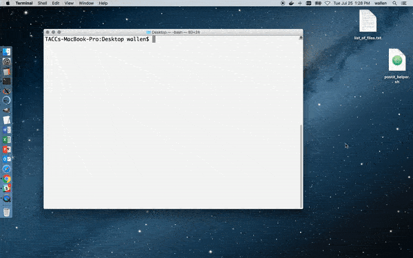

## Postit Helper Tool

Postits are a quick way to share a file with someone else via an HTML link. But, what if you want to share multiple files? Or the complete contents of a directory? This tutorial will show you how to script the creation of multiple postits, then share all postits at once through a single HTML-rendered page.


### Part 1: Create a list of files to share

This tutorial assumes you are sharing files located on the CyVerse data store - `data.iplantcollaborative.org`. But, it could easily be adapted to other Agave storage systems.

The list of files you would like to share should include the full path to each file relative to the "root" directory on the storage system. For example, when I list the contents of my home directory on the CyVerse data store, I see three directories and three files:

```
$ files-list -S data.iplantcollaborative.org /wallen/
dr--------  wallen  0       09:59  .
dr--------  wallen  0       11:17  analyses
dr--------  wallen  0       16:23  applications
dr--------  wallen  0       11:44  archive
-r--------  wallen  312110  13:41  my_data_fastqc.zip
-r--------  wallen  178392  09:53  protein.pdbqt
-r--------  wallen  85060   13:57  sequence12.fasta
```

(Replace `/wallen/` with your CyVerse username). Supposing I wanted to share the three files located in my home directory, I would need to create a text file that contains these three lines:

```
/wallen/my_data.fastqc.zip
/wallen/protein.pdbqtp
/wallen/sequence12.fasta
```

This can be done with your favorite __plain text__ editor, or by issuing this command:

```
cat << EOF > list_of_files.txt
/wallen/my_data.fastqc.zip
/wallen/protein.pdbqtp
/wallen/sequence12.fasta
EOF
```


### Part 2: Run the postit helper script

Next, download the postit helper script [here](postit_helper.sh).

This sample script is not extremely robust in that it does very little error checking. It does not check, for example, for correctness in the `list_of_files.txt` or whether the files actually exist. Further, the number of accesses (10), time available (600s), and storage system (`data.iplantcollaborative.org`) are hard coded into the script. It is left to the user to customize beyond the default settings.

Once it is copied, simply execute the script providing the list of files as a command line argument:

```
$ bash postit_helper.sh list_of_files.txt
```

The final result will return a link to a page where all your files can be downloaded by name in an HTML interface.


<center></center>


[Back to: README](../README.md)
